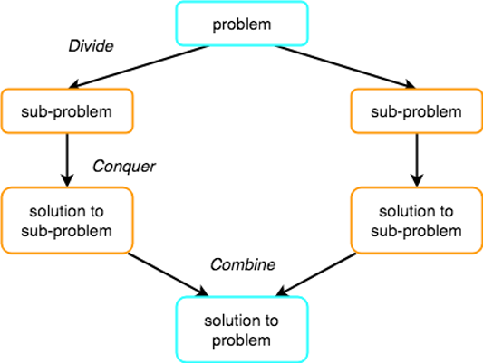
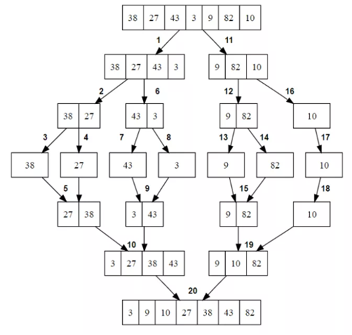

# 3. Divide and Conquer

We can choose from a wide range of algorithm design techniques. For insertion sort, we used an incremental approach: having sorted the subarray `A[1 .. j-1]`, we inserted the single element `A[j]` into its proper place, yielding the sorted subarray `A[1 .. j]`.

Here we will examine an alternative design approach, known as "divide-and-conquer". We'll use divide-and-conquer to design a sorting algorithm whose worst-case running time is much less than that of insertion sort. One advantage of divide-and-conquer algorithms is that their running times are often easily determined.

Many useful algorithms are recursive in structure: to solve a given problem, they call themselves recursively one or more times to deal with closely related sub-problems. These algorithms typically follow a divide-and-conquer approach: they break the problem into several subproblems that are similar to the original problem but smaller, solve the subproblems recursively, and then combine these solutions to create a solution to the original problem.

Figure 3.1



The divide-and-conquer paradigm involves three steps at each level of the recursion:
- Divide the problem into a number of subproblems that are smaller instances of the same problem.
- Conquer the subproblems by solving them recursively. If the subproblem sizes are small enough, however, just solve the subproblems in a straightforward manner.
- Combine the solutions to the subproblems into the solution for the original problem.

The merge sort algorithm closely follows the divide-and-conquer paradigm. Intuitively, it operates as follows.
- Divide: Divide the n-element sequence to be sorted into two subsequences of `n/2` elements each.
- Conquer: Sort the two subsequences recursively using merge sort.
- Combine: Merge the two sorted subsequences to produce the sorted answer

Figure 3.1



## 3.1 Merge Sort

```ts title="Listing 3.1"
function merge(left, right) {
  const result = [];

  while (left.length || right.length) {
    counter++;

    if (left.length && right.length) {
      if (left[0] < right[0]) {
        result.push(left.shift());
      } else {
        result.push(right.shift());
      }
    } else if (left.length) {
      result.push(left.shift());
    } else {
      result.push(right.shift());
    }
  }

  return result;
}

function sort(array) {
  const length = array.length;
  const mid = Math.floor(length * 0.5);
  const left = array.slice(0, mid);
  const right = array.slice(mid, length);

  if (length === 1) {
    return array;
  }

  return merge(sort(left), sort(right));
}
```

This is how `mergeSort` looks like. We take half the length of the array and divide it into two parts. And we call the merge function to the same sorting from the left and right sides. The merge function itself compares and merges our sequences.

Although the code for merge sort works correctly when the number of elements is not even, our recurrence-based analysis is simplified if we assume that the original problem size is a power of 2. Each divide step then yields two subsequences of size exactly `n/2`. This assumption does not affect the order of growth of the solution to the recurrence.

We reason as follows to set up the recurrence for `T(n)`, the worst-case running time of merge sort on n numbers. Merge sort on just one element takes constant time. When we have `n > 1` elements, we break down the running time as follows.

Divide: The divide step just computes the middle of the subarray, which takes constant time. Thus, `D(n) = Θ(1)`.

Conquer: We recursively solve two subproblems, each of size `n/2`, which contributes `2T(n/2)` to the running time.

Combine: We have already noted that the MERGE procedure on an n-element subarray takes time `Θ(n)`, and so `C(n) = Θ(n)`.

When we add the functions `D(n)` and `C(n)` for the merge sort analysis, we are adding a function that is `Θ(n)` and a function that is `Θ(1)`. This sum is a linear function of `n`, that is `Θ(n)`. Adding it to the `2T(n/2)` term from the "conquer" step gives the recurrence for the worst-case running time `T(n)` of merge sort:

<div class="formula">
  1\end{cases}" title="T(n)=\begin{cases}\theta(1)&\text{ if }n=1\\2T(\frac{n}{2})+\theta(n)&\text{ if }n>1\end{cases}" />
</div>
## 3.2 Master Method and Theorem

The master method provides a "cookbook" method for solving recurrences of the form:


where `a ≥ 1` and `b > 1` are constants and `f(n)` is an asymptotically positive function.

According to the master theorem:
- If <code>f(n) = O(n<sup>log<sub>b</sub>a-ϵ</sup>)</code> for some constant `ϵ > 0`, then <code>T(n) = θ(n<sup>log<sub>b</sub>a</sup>)</code>
- If <code>f(n) = θ(n<sup>log<sub>b</sub>a</sup>)</code> then <code>T(n) = θ(n<sup>log<sub>b</sub>a</sup>lgn)</code>
- If <code>f(n) = Ω(n<sup>log<sub>b</sub>a+ϵ</sup>)</code> for some constant `ϵ > 0`, and if `af(n/b) < cf(n)` for some constant `c < 1` and all sufficiently large `n`,
- then `T(n) = θ(f(n))`

Let's use the master method to solve the "divide and conquer" recurrence: `2T(n/2) + Θ(n)`. Here, we have `a=2`, `b=2`, `f(n) = Θ(n)`, and thus we have that: <code>n<sup>log<sub>b</sub>a</sup> = n<sup>log<sub>2</sub>2</sup> = n</code>. Case 2 applies, since `f(n) = Θ(n)`, and so we have the solution: `T(n) = Θ(nlgn)`.
