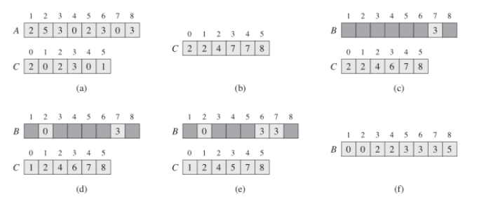
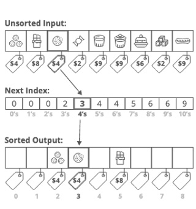
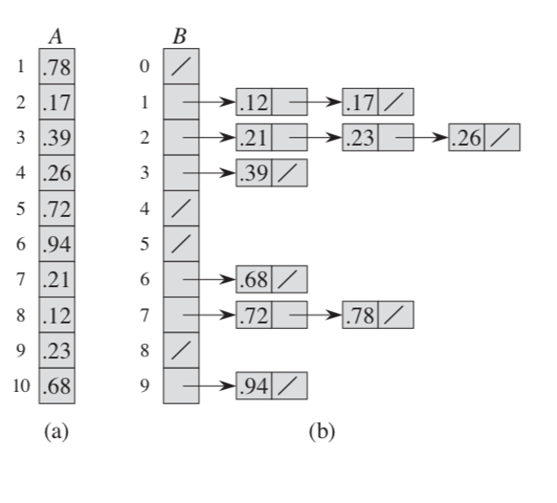
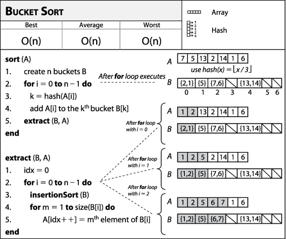

# 5. Sorting in Linear Time

## 5.1 Counting Sort

We do not compare the elements, we go through the entire array once and count the number of elements that is less than the given one. We are building another array where we will store temporary data. This array contains the indices that are contained in the original collection.

Counting sort assumes that each of the n input elements is an integer in the range `0` to `k`, for some integer `k`. When `k = O(n)`, the sort runs in `Θ(n)` time.

**Counting sort** determines, for each input element `x`, the number of elements less than `x`. It uses this information to place element `x` directly into its position in the output array. For example, if `17` elements are less than `x`, then `x` belongs in output position `18`. We must modify this scheme slightly to handle the situation in which several elements have the same value, since we do not want to put them all in the same position.

In the code for counting sort we assume that the input is an array `A[1..N]`, and thus `A.length = n`. We require two other arrays: the array `B[1..n]` holds the sorted output, and the array `C[0::k]` provides temporary working storage.

Figure 5.1



We take the maximum and minimum values and create an array. Then we go through the original array, perceiving its elements as indices. And add from zero to the number of occurrences, then the number of elements is less than it.

```ts title="Listing 5.1"
function countingSort(arr) {
  const count = [];
  const result = [];
  const min = Math.min(...arr); // O(n)
  const max = Math.max(...arr); // O(n)

  for (let i = min; i <= max; i++) {
    count[i] = 0;
  }

  for (let i = 0; i < arr.length; i++) {
    count[arr[i]]++;
  }

  for (let i = 1; i < count.length; i++) {
    count[i] = count[i] + count[i - 1];
  }

  for (let i = 0; i < arr.length; i++) {
    result[count[arr[i]] - 1] = arr[i];
    count[arr[i]]--;
  }

  return result;
}
```

Thus, in the resulting array, we contain the indices and assign the value from the original array by indices. Thus, although not in one pass, but without nesting, we sorted it. We get a constant multiplied by `n`. And as it was said, the constant can be neglected at large values. A special case may be when we calculate not the number of elements that are greater than or equal, but the number of occurrences and then, by the number of occurrences, make up the resulting array. But there is one problem, our numbers are not always integers. It is very often necessary to sort the fractional ones. Very often you can write fractional numbers in some form from `0` to one.

Figure 5.2



## 5.1 Bucket Sort

We move on to the bucket sort. Here we do not add the number of elements, but we divide into some baskets, for example, from `0` to `0.1`, from `0.1` to `0.2` to one. More often they hit a larger number, especially if there are patterns in the incoming data. They don't have to be uniform. We have an array of these buckets, each of which is also an array into which we will write our values.

Bucket sort assumes that the input is drawn from a uniform distribution and has an average-case running time of `O(n)`. Like counting sort, bucket sort is fast because it assumes something about the input. Whereas counting sort assumes that the input consists of integers in a small range, bucket sort assumes that the input is generated by a random process that distributes elements uniformly and independently over the interval `[0; 1)`.

Bucket sort divides the interval `[0; 1)` into n equal-sized sub-intervals, or buckets, and then distributes the n input numbers into the buckets. Since the inputs are uniformly and independently distributed over `[0; 1)`, we do not expect many numbers to fall into each bucket. To produce the output, we simply sort the numbers in each bucket and then go through the buckets in order, listing the elements in each.

Our code for bucket sort assumes that the input is an n-element array A and that each element `A[i]` in the array satisfies `0 ≤ A[i] < 1`. The code requires an auxiliary array `B[0..n – 1]` of linked lists (buckets) and assumes that there is a mechanism for maintaining such lists.

Figure 5.3



For example, we have values. We will add this to our buckets. Most often, we have information about the regularity of the input values and most often the sizes are selected to minimize the size of the bucket, contain 1-2 elements. Since there are few of them inside the bucket, we can ignore their sorting time. We simply merge the sorted buckets into an array.

```ts title="Listing 5.2"
function bucketSort(array) {
  const temp = [0..array.length - 1];

  for (let i = 0; i < array.length; i++){
    // make temp[i] an empty list
  }

  for (let i = 0; i < array.length; i++) {
    // insert array[i] into list temp[Math.floor(array[i])]
  }

  for (let i = 0; i < temp.length; i++ ){
    // sort temp[i];
  }

  return // concatenated temp
}
```

The tricky part is that we have to sort the elements within the bucket. Even though we chose the size of the buckets very well, it so happens that there are a lot of input buckets. For example, we simulate a physical process, and we simulate several million molecules, since there are a lot of input data in buckets, there are also a large number of elements and, as you can see in the example, `insertionSort` is indicated in the sources, but it may not be able to cope with them. In those cases, you can use a data structure other than an array.

Figure 5.4


